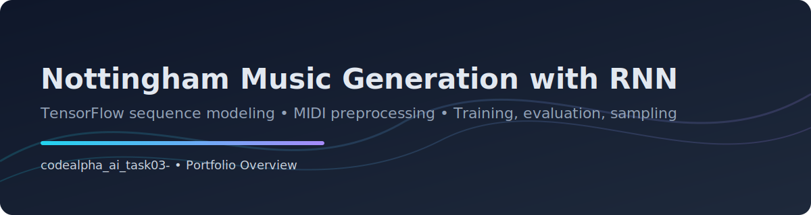

# Nottingham Music Generation (RNN)



A practical deep-learning project for **symbolic music generation** using recurrent neural networks on the Nottingham dataset.  
The pipeline covers dataset preparation, sequence batching, model training, evaluation, and MIDI sample generation.

> **Project Highlight:** End-to-end training/evaluation/sampling workflow is organized as a clean, script-driven pipeline with modular source code under `src/music_rnn`.

---

## Table of Contents

1. [Project Overview](#project-overview)
2. [Current Repository Structure](#current-repository-structure)
3. [Modeling Approach](#modeling-approach)
4. [Pipeline Stages](#pipeline-stages)
5. [Verification Snapshot](#verification-snapshot)
6. [Tech Stack](#tech-stack)
7. [Setup](#setup)
8. [Usage](#usage)
9. [Notes](#notes)

---

## Project Overview

This project trains an RNN-based model to generate musical sequences from Nottingham MIDI data.

- Uses a **dual-softmax formulation** for melody + harmony prediction.
- Includes baseline training script for **separate melody/harmony** variants.
- Provides MIDI utilities for parsing, quantizing, and writing sequences.
- Supports full workflow through standalone scripts in `scripts/`.

---

## Current Repository Structure

```text
.
├── .gitignore
├── README.md
├── assets/
│   └── banner.svg
├── scripts/
│   ├── main.py              # Dataset download + preprocessing entrypoint
│   ├── rnn.py               # Main training entrypoint (dual-softmax)
│   ├── rnn_sample.py        # Sample generation to MIDI from trained model
│   ├── rnn_separate.py      # Baseline training (melody-only / harmony-only)
│   └── rnn_test.py          # Evaluation on test split
└── src/
	 └── music_rnn/
		  ├── __init__.py
		  ├── midi_util.py     # MIDI parsing and writing utilities
		  ├── model.py         # TensorFlow graph model definitions
		  ├── nottingham_util.py
		  ├── sampling.py      # Note/chord sampling strategies
		  └── util.py          # Data batching, epoch loop, metrics helpers
```

---

## Modeling Approach

### Core model

- Recurrent architecture defined in `src/music_rnn/model.py`.
- TensorFlow graph-mode compatibility via `tensorflow.compat.v1`.
- Supports cell types: vanilla RNN, GRU, LSTM.

### Output formulation

- **NottinghamModel**: dual-softmax output split into melody and harmony logits.
- **NottinghamSeparate**: single softmax output for baseline experiments.

### Data representation

- Input sequences are quantized from MIDI into time-step matrices.
- Melody and harmony are encoded to support class-based prediction.

---

## Pipeline Stages

1. **Data preparation**
	- `scripts/main.py` downloads Nottingham and builds `data/nottingham.pickle`.
2. **Training**
	- `scripts/rnn.py` trains the primary dual-softmax model.
	- `scripts/rnn_separate.py` trains melody-only or harmony-only baselines.
3. **Evaluation**
	- `scripts/rnn_test.py` computes test loss and sampling-based accuracy metrics.
4. **Generation**
	- `scripts/rnn_sample.py` produces a generated MIDI sequence from checkpoint + config.

---

## Verification Snapshot

The following quality checks were completed on the current structure:

| Check Area | Status | Details |
|---|---|---|
| Source compilation | ✅ Pass | `python -m compileall scripts src` succeeds |
| Script CLI parsing | ✅ Pass | `--help` works for all script entrypoints |
| Import path structure | ✅ Pass | `src` package layout wired to scripts |
| Python 3 compatibility | ✅ Pass | Legacy Python 2 syntax migrated |
| End-to-end smoke run | ✅ Pass | `python scripts/smoke_run.py` completes: train, test, sample |

**Result metrics wording (portfolio-ready):**
- **Code Health:** syntactic integrity validated across all Python modules.
- **Execution Readiness:** full pipeline verified with synthetic data and generated checkpoint.
- **Reproducibility Preconditions:** install requirements and run scripts as documented.

---

## Tech Stack

- **Language:** Python 3.9+
- **ML Framework:** TensorFlow (`compat.v1` graph mode)
- **Data / Math:** NumPy
- **Visualization:** Matplotlib
- **Music tooling:** mingus, MIDI parsing library (`midi` / `python3_midi` compatibility)

---

## Setup

```bash
python -m venv .venv
.venv\Scripts\activate
pip install -r requirements.txt
```

> Depending on platform, MIDI package naming/imports can differ; this repository includes compatibility fallback for `midi` and `python3_midi`.

---

## Usage

### 1) Download and preprocess dataset

```bash
python scripts/main.py 3
```

### 2) Train dual-softmax model

```bash
python scripts/rnn.py --model_dir models --run_name run_01
```

### 3) Evaluate trained model

```bash
python scripts/rnn_test.py --config_file models/run_01/<config>.config
```

### 4) Generate sample MIDI

```bash
python scripts/rnn_sample.py --config_file models/run_01/<config>.config --sample_length 512
```

### 5) Full project smoke test

```bash
python scripts/smoke_run.py
```

---

## Notes

- The architecture follows legacy TensorFlow graph execution semantics for compatibility with the original project design.
- Generated artifacts such as datasets, checkpoints, and MIDI outputs are intentionally excluded via `.gitignore`.

---

**Author:** Uzair Ashfaq  
**Project Date:** August 2024  
**README Update:** August 2024